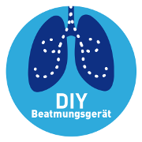

  

# DIY-Beatmungsgerät

DIY Beatmungsgerät basierend auf einem Open Source und Open Hardware Entwurf. Der Grundstein wurde während des [#WirvsVirusHackathon](https://wirvsvirushackathon.org/) im März 2020 gelegt.

Momentan sind wir noch mitten im Endspurt des Wochenendes, daher wird es noch eine Weile dauern, bis dieses Repository tatsächlich mit unseren Inhalten gefüllt ist. Derzeit pflegen wir unsere Inhalte noch intern ein!

Das 3D-Modell des Beatmungsgerätes basiert auf Iteration #6 des Open Source Ventilator (OSV) Project, in gitlab unter https://gitlab.com/open-source-ventilator/OpenLung zu finden.

(eventuell wechseln wir die Dokumentation hier auf Englisch)

## Repository-Struktur

Wir arbeiten an verschiedensten Themen. Zum einen etwa an der Weiterentwicklung des Beatmungsgerätes, als auch an dessen Ansteuerung bzw. Regelung und weiterer Sensorik.

* [/ hardware / mass-airflow-model /](/hardware/mass-airflow-model/): Modelle für die Röhre eines Masseflusssensors
* [/ hardware / ventilator-model/](/hardware/ventilator-model/): das weiterentwickelte Modell des Beatmungsgerätes
* [/ software / mass-airflow-sensor / controller-software/](/software/mass-airflow-sensor/controller-software/): die Software, die auf der Plattform läuft, um den Luftmassesensor auszulesen (Mock-Up)
* [/ software / mass-airflow-sensor / sensor-software/](/software/mass-airflow-sensor/sensor-software/): die Software, die auf dem Sensor selbst läuft, der Luftmassesensor-Daten bereitstellt (Mock-Up)
* [/ software / ventilator-control/](/software/ventilator-control/): die Software für die Steuerungs-Plattform des Beatmungsgerätes

# Weiterführende Links
* [Homepage des WirvsVirus Hackathon](https://wirvsvirushackathon.org/)
* [Projekt-Vorstellung auf devpost.com](https://devpost.com/software/diy-beatmungsgerat)
* [Projekt-Vorstellung auf YouTube](https://www.youtube.com/watch?v=DzOd6LIBdXI)
* https://gitlab.com/open-source-ventilator/OpenLung
